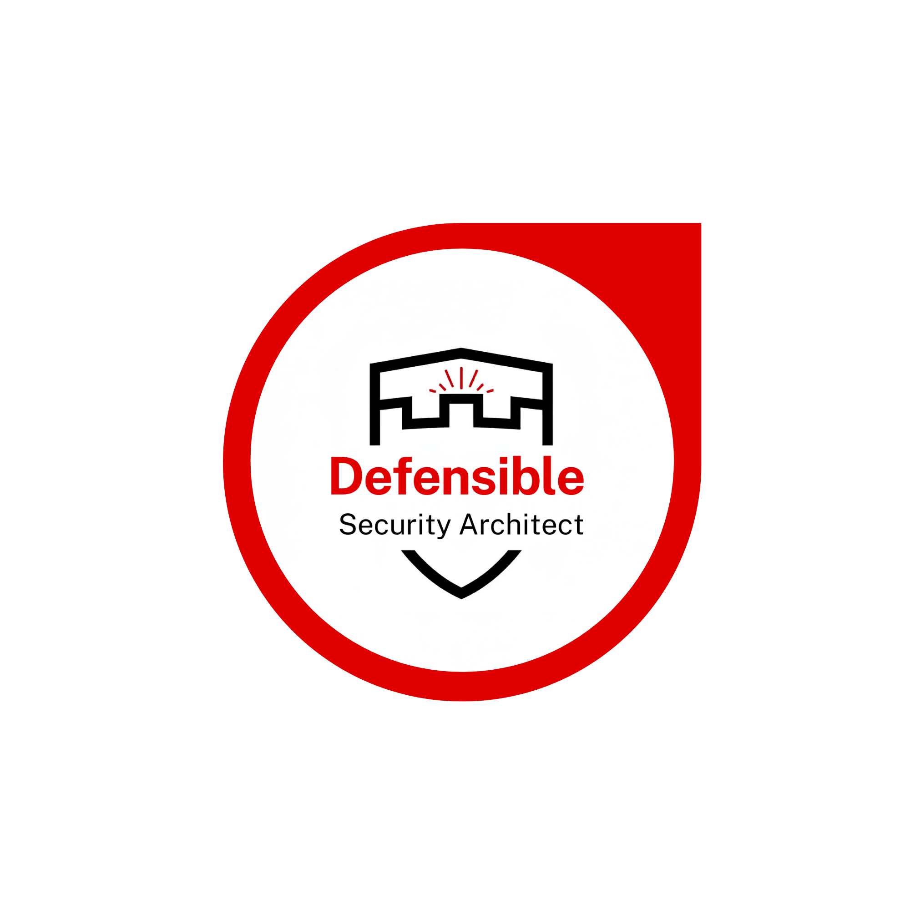
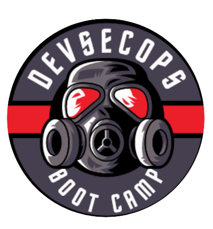
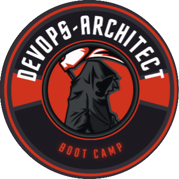
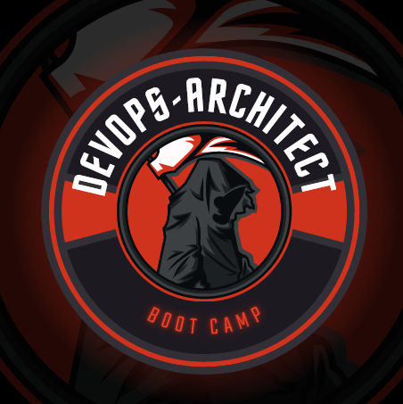
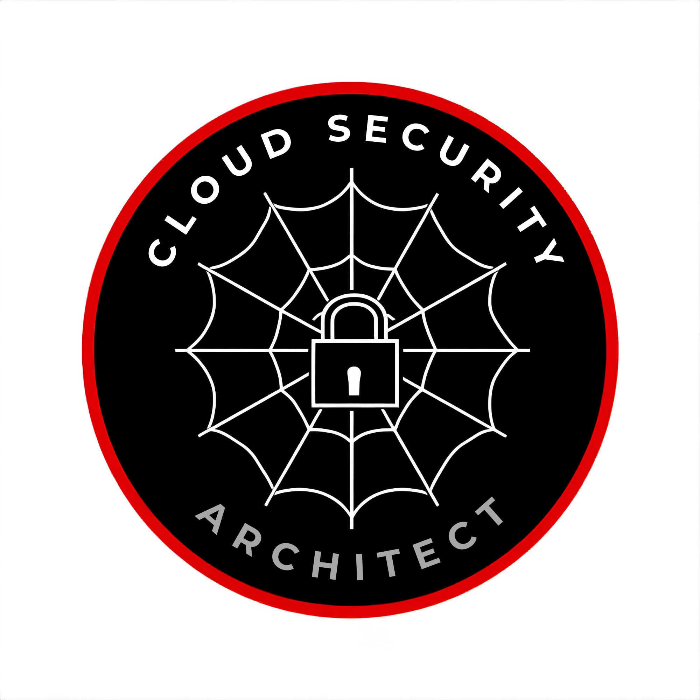

- 👋 Hi, I’m @BilalMaz
- 👀 I’m interested in Cyber Security , Data Science , AI , Machine Learning , Cloud , Kubernetes , Blockchain , FinTech 
- 🌱 I’m currently learning Data Science and AI / DevSecOps
- 💞️ I’m looking to collaborate on Free and Open Source Educational Curriculums
- 📫 Reach me @ bilalmaz2010@gmail.com

<table style="width:100%">
 
  <tr>
    <td></td>
    <td></td>
    <td></td>
  </tr>
  <tr>
    <td></td>
     <td></td>

  <td></td>
     <td></td>

  </tr>
 
 
 

<!---
BilalMaz/BilalMaz is a ✨ special ✨ repository because its `README.md` (this file) appears on your GitHub profile.
You can click the Preview link to take a look at your changes.
--->
